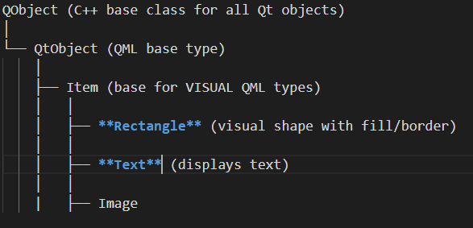

````markdown
# d1_plugin_component.qml

Das war viel Theorie, ich weiß. Aber ich denke, wir haben jetzt genug von der QML-Struktur behandelt, dass der Rest viel schneller gehen wird.  

Schauen wir uns den Plugin-Code an, der vom pluginLoader geladen wird.  

Er ist ziemlich einfach. Nur ein einfacher Bildschirm mit einem Label, der sich auf den Bildschirm ausdehnt.

```qml
< ... Imports ...>

Rectangle {
    id: pluginFrame
    anchors.fill: parent
    color: PluginTheme.vanilla
    Text {
        text: "Demo 1 Vegetation Monitoring: Plugin Component"
        color: PluginTheme.green
        font.pixelSize: 20
        horizontalAlignment: Text.AlignHCenter             
        anchors.centerIn: parent
    }
    Component.onCompleted: {
        iface.logMessage("d1_plugin_component.qml loaded")
    }
}

```
Hier haben Sie kein Item, sondern ein Rectangle, das ein Item ist, genau wie ein QtFrame ein QtWidget ist.  

  


## Eine QML-Textbox

Unser einfacher Bildschirm mit einem Label ist nur eine Textbox. Es gibt keine TextBox in QML. Wir brauchen 2 Objekte: Rectangle und Text.  

### Text vs QfText

Wie bei QfToolButton hätte ich auch hier die Option, einen QfText zu verwenden. Aber ich habe mich entschieden, die einfachen Qt-Items über die Hauptcode-Datei hinaus zu verwenden. Warum?

- Die QField-Items sind gut, wenn Sie möchten, dass Ihr Plugin wie eine QField-Komponente aussieht, als wäre es ein integrierter Teil von QField.
- Aber ich muss mein Plugin visuell unterscheiden. Also gehe ich meinen eigenen Weg.
- Außerdem, wenn ich bei den Qt-Items bleibe, muss ich nur über die Qt-Items lernen.

## Verwendung von PluginTheme

Wir haben in [Plugin-Struktur](DEMO1_STRUCTURE.md) die Definition von PluginTheme als Konfigurationsobjekt besprochen, das unsere Farbpalette enthält. In d1_plugin_component sehen Sie, dass die Farbe des Rectangle auf PluginTheme.vanilla gesetzt ist und die Farbe des Text auf PluginTheme.green. Ganz einfach.


## 📚 **[>> Demo2: Feature-Auswahl!](../demo2/DEMO2_INTRO.md)**
## 📚 **[<< Hauptmodul](DEMO1_MAIN.md)**


````