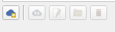

````markdown
# Bereitstellung des demo1_hello Projekts in QField

1. Kopieren Sie **\${ROOT}\qfield_vegetation_monitoring\demo1_hello** nach
        **${ROOT}\projects\demo1_hello**
2. Öffnen Sie das Projekt in QGIS.
      - Sie sollten nur einen einzelnen Layer (plots) mit ein paar Punkten darin sehen. Dies ist der Auswahl-Layer für das Plugin.
3. Laden Sie das Projekt mit dem QField Sync Plugin auf QFieldCloud hoch.
      - Erstellen Sie ein neues Projekt  

         

      - Erstellen Sie ein neues leeres Projekt  

         

      - Geben Sie ihm einen Namen und belassen Sie das lokale Projektverzeichnis als Ihr Entwicklungsverzeichnis unter ${ROOT}  

           

      - Laden Sie Dateien hoch.  
      
           
      
5. Laden Sie das Projekt in QField für Windows

      - Das Kamerasymbol rechts wird verwendet, um das Plugin zu öffnen und zu schließen. Los geht's. Öffnen und Schließen Sie es. 
      - Überprüfen Sie diese Log-Nachrichten und stellen Sie sicher, dass Sie unsere schönen Debug-Nachrichten sehen und nicht irgendwelche Fehler. 

          

6. Fertig. Sie haben bereitgestellt.

## Aktualisierung des Projekts

Wenn Sie das Plugin aktualisieren, verwenden Ihre Benutzer die Schaltfläche Synchronisieren, um Updates zu erhalten, genau wie beim Projekt.

1. Öffnen Sie das Plugin, indem Sie auf die Kamera klicken, und beachten Sie den Titeltext. Wir werden das Projekt aktualisieren, indem wir den Text ändern.

     

1. Öffnen Sie **\${ROOT}\projects\demo1_hello\components\d1_plugin_component.qml** in Ihrem Editor.
2. Finden Sie den Text, den Sie auf dem Bildschirm sehen. Er sollte um Zeile 26 herum sein.
```qml
    Text {
        text: "Vegetation Monitoring: Plugin Component"
        color: PluginTheme.green
        font.pixelSize: 20
        horizontalAlignment: Text.AlignHCenter             
        anchors.centerIn: parent
    }
```
3. Ändern Sie diesen Text in etwas anderes.
4. Verwenden Sie in QGIS im QField Sync Plugin die Schaltfläche Sync, um das Projekt zu synchronisieren.  

   

5. QField Sync sollte die Änderung erkennen und die neue Version der Datei hochladen.  
     

6. Gehen Sie zu QField und verwenden Sie die Schaltfläche Synchronisieren, um das Projekt und sein Plugin zu aktualisieren.
   - Wenn Sie Ihre Änderung nicht sofort sehen, kann es notwendig sein, QField neu zu starten.

## Bereitstellung und Aktualisierung des demo1_hello Projekts in der Entwicklung

Wenn Sie versuchen, dieses Protokoll in Ihrem Entwicklungsprozess zu verwenden, werden Sie völlig den Verstand verlieren. Bis Sie ein auslieferbares Plugin haben, richten Sie es als lokales QField-Projekt ein. Ich bin zu beschämt zu sagen, wie lange ich mich durch den Synchronisierungsprozess geschleppt habe, bevor ich klug wurde.

1. Holen Sie sich Ihren Pfad zu Ihrem Desktop-QField. Meiner ist C:\Program Files\QField\usr\bin\qfield.exe, aber Ihrer kann anders sein.
2. QField entwickelt sich schnell. Halten Sie Ihr QField von der Releases-Seite aktualisiert: https://github.com/opengisch/qfield/releases
3. Führen Sie QField von der Befehlszeile aus, um Ausgaben auf console.log und console.error-Nachrichten zu erhalten. Rufen Sie es mit dem Pfad zu Ihrem Projekt auf. Keine QField Sync-Verpackung ist notwendig. 
```dos
"C:\Program Files\QField\usr\bin\qfield.exe" C:\temp\qfield\demo1_hello\demo1_hello.qgs
```
4. Wenn Sie Ihren Code aktualisieren, schließen Sie einfach QField und führen Sie den Befehl erneut aus.

## 📚 **[>> Schauen wir uns die Plugin-Struktur an](DEMO1_STRUCTURE.md)**
## 📚 **[<< Demo1 Einführung](DEMO1_INTRO.md)**
````