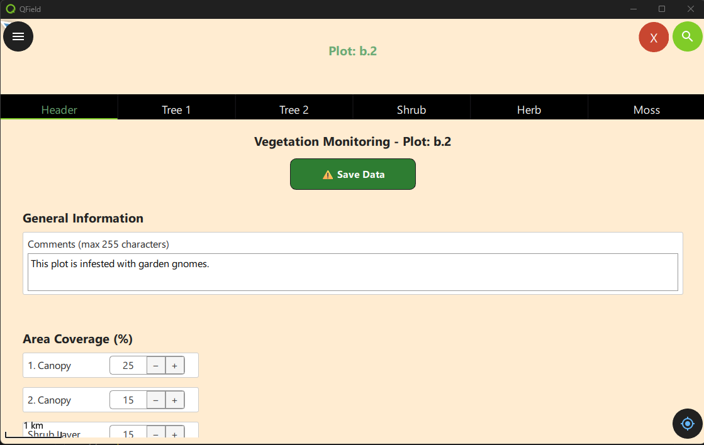

````markdown
# Demonstration 4: Feature-Bearbeitung 

Diese Demonstration erweitert das Tab-Widget, das in qfield_vegetation_monitoring/demo3_tabwidget eingeführt wurde. Jedes Jahr erfassen die Biologen einige grundlegende Informationen über das Plotfeld, wie die durchschnittliche Vegetationshöhe, und zeichnen sie in der Tabelle plot_header auf. Wenn wir unser Tab-Widget öffnen, ist die Header-Seite der erste Tab. Diese Demonstration richtet die Header-Seite für das Tab-Widget ein. Die UI in dieser Demonstration ist zu komplex, um in diesem Workshop behandelt zu werden. Wir werden es Ihnen überlassen, es später zu überprüfen. Wir werden uns hier auf die guten Teile konzentrieren - die QField-Schnittstelle zur Bearbeitung von Features.

## Was wir lernen werden

- Wie man eine Zeile zu einer Tabelle über die QField-Schnittstelle hinzufügt
- Wie man eine Zeile über die QField-Schnittstelle aktualisiert
- VIEL UI-Zeug, das wir nur überfliegen werden.

## Was macht es?

- Wenn der Benutzer auf das Canvas klickt, wird die Plot-ID von der Plugin-Component an das Tab-Widget und an die Header-Seite des Tab-Widgets in d5_headerpage.qml gesendet
- Hinweis: Das Formular ist lang. Das Formular hat einen unsichtbaren Scrollbereich, der über das Mausrad unter Windows oder Wischen auf iOS zugänglich ist.
- Beim Laden wird überprüft, ob bereits eine Zeile in der plot_header-Tabelle existiert.  

    - Wenn keine plot_header-Zeile existiert, wird sofort eine hinzugefügt. Diese Zeile hat Standardwerte für alle Eingaben.
        - 0 für alle numerischen Werte
        - Leerstring für Textfelder
        - eine UUID für den Primärschlüssel
        - der aktuelle Zeitstempel
        - die Plot-ID als Fremdschlüssel für Plot.
    - Wenn bereits eine plot_header-Zeile existiert, werden die Werte in das Formular geladen
- Dieses Formular hat auf Benutzerwunsch keine automatische Speicherung.
- Wenn ein Wert aktualisiert wird, ändert sich der Text der Speichern-Schaltfläche, um nicht gespeicherte Änderungen anzuzeigen.
- Wenn der Benutzer auf die Speichern-Schaltfläche klickt, werden Änderungen an allen Werten gespeichert und committet.
 



# Einrichtung

1. Erstellen Sie ein neues Projektverzeichnis: ${ROOT}/qfield_project_demo_4 
2. Kopieren Sie das gesamte Demo-Verzeichnis \${ROOT}/qfield_vegetation_plugin/demo4_header_form nach ${ROOT}/qfield_project_demo_4
3. Öffnen Sie das Projekt in QGIS, wenn Sie die Struktur der plot_header-Tabelle sehen möchten. Diese ist im Projekt als privater (versteckter) Layer ohne Geometrie enthalten.
4. Führen Sie QField von der Befehlszeile aus, um das Projekt direkt als lokales Projekt zu öffnen.
```dos
"C:\Program Files\QField\usr\bin\qfield.exe C:\temp\qfield\demo4_header_form\demo4_header_form.qgs
```


## 📚 **[Zur Header-Seite gelangen](DEMO4_PLUGIN_COMPONENT.md)**
## 📚 **[<< Demonstration 1](../demo2/DEMO2_INTRO.md)**


````