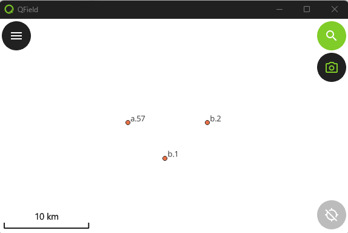

# Delivering the demo1_hello Project to QField

1. Copy **\${ROOT}\qfield_vegetation_monitoring\demo1_hello** to
        **${ROOT}\projects\demo1_hello**
2. Open the project in QGIS.
      - You should see just a single layer (plots) with a few points in it.  This is the selection layer for the plugin.
3. Upload the project to QFieldCloud using the QField Sync Plugin.
      - Create a new project  

         

      - Create new empty project  

         

      - Give it a name and leave the local project directory as your development directory under ${ROOT}  

           

      - Upload Files.  
      
           
      
5. Load the project in the Windows QField

      - The camera icon on the right is used to open and close the plugin.  Go ahead.  Open and Close it. 
      - Check those log messages and make sure you see our nice debug messages and not some errors. 

          

6. There.  You have Deployed.

## Updating the Project

When you update the plugin, your users will use the Synchronise button to recieve updates, just like with the project.

1. Open the plugin by clicking on the camera and notice the title text.  We will update the project by changing the text.

     

1. Open **\${ROOT}\projects\demo1_hello\components\d1_plugin_component.qml** in your editor.
2. Find the text you see in the screen.  It should be around line 26.
```qml
    Text {
        text: "Vegetation Monitoring: Plugin Component"
        color: PluginTheme.green
        font.pixelSize: 20
        horizontalAlignment: Text.AlignHCenter             
        anchors.centerIn: parent
    }
```
3. Change that text to something else.
4. In QGIS, in QField Sync Plugin, use the Sync button to synchronise the project.  

   

5. QField Sync should pick up the change and upload the new version of the file.  
     

6. Go to QField and use the Synchronise Button to update the project and its plugin.
   - If you do not see your change straight away it may be necessary to start QField again.

## Delivering and Updating the demo1_hello Project in development

If you try to use this protocol in your development process you will completely lose your mind.  Until you have a deliverable plugin, set it up as a local QField Project.  I am too embarassed to say how long slogged through the synchronising process before I got wise.

1. Get your path to your desktop QField.  Mine is C:\Program Files\QField\usr\bin\qfield.exe, but yours may be different.
2. QField develops fast.  Keep your QField updated from the releases site: https://github.com/opengisch/qfield/releases
3. Run QField from the command line to get prints to the console.log and console error messages.  Call it with the path to your project.  No QField Sync Packaging is necessary. 
```dos
"C:\Program Files\QField\usr\bin\qfield.exe" C:\temp\qfield\demo1_hello\demo1_hello.qgs
```
4. When you update your code, just close QField and run the command again.

## 📚 **[>> Let's Look at the Plugin Structure](DEMO1_STRUCTURE.md)**
## 📚 **[<< Demo1 Introduction](DEMO1_INTRO.md)**