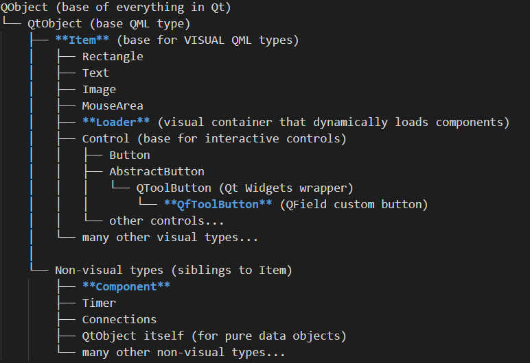

# demo1_hello.qml

This is the main qml file, which loads and unloads the plugin code and it's toolbar buttons.

## QML is not quite Qt

QML is basically a transformation of the Qt .ui layout file into a programming language, with some javascript smooshed in to give extra functionality.  A QML app doesn't think of itself as a program.  It thinks of itself as a user interface that does stuff.  So if you start out as a programmer used to building QGIS plugins which are programs with user interfaces, this is going to be frustrating.  But imagine the xml in a ui file, and then imagine that it was transformed into a different syntax, and this qml file structure will start to make more sense.


<div style="display: flex; gap: 20px;">
<div style="flex: 1;">

**QML Code**

```qml
// <!--Imports...-->

import org.qfield 
import Theme  


Item {  
  id: plugin
  parent: iface.mapCanvas() 
  anchors.fill: parent 
  Loader {
    id: pluginLoader
    active: false
    anchors.fill: parent
    source: Qt.resolvedUrl('./components/d1_plugin_component.qml')
  }  
  QfToolButton {
    id: pluginButton
    bgcolor: Theme.darkGray
    iconSource: Theme.getThemeVectorIcon(
      'ic_camera_photo_black_24dp'
    )
    iconColor: Theme.mainColor
    round: true

    onClicked: {
      iface.logMessage(
        "Loading d1_plugin_component.qml"
      )
      pluginLoader.active = 
        !(pluginLoader.active)
    }
  }

  Component.onCompleted: {
    iface.addItemToPluginsToolbar(
      pluginButton
    )
  }
} 
```

</div>
<div style="flex: 1;">

**Approximate Qt .ui (XML) equivalent**

```xml
<?xml version="1.0" encoding="UTF-8"?>
<ui version="4.0">
 <widget class="QWidget" name="plugin">
  <property name="geometry">
   <!-- geometry properties -->
  </property>
  <layout class="QVBoxLayout">
   <item>
    <widget class="QWidget" name="pluginLoader">
     <property name="visible">
      <bool>false</bool>
     </property>
     <!-- Dynamic loading needs code -->
    </widget>
   </item>

   <item>
    <widget class="QPushButton" name="pluginButton">
     <property name="text">
      <string></string>
     </property>
     <property name="icon">
      <iconset theme="camera">
       <normaloff>
         :/icons/ic_camera_photo_black_24dp
       </normaloff>
      </iconset>
     </property>
     <property name="styleSheet">
      <string>
        background-color: rgb(64, 64, 64); 
        border-radius: 20px;
      </string>
     </property>
    </widget>
   </item>
  </layout>
 </widget>
 <!-- No Component.onCompleted -->
 <!-- No onClicked logic -->
 <!-- Would need Python/C++ code -->
</ui>
```

</div>
</div>


## Connections: Property expressions vs signals and slots 

QML uses javascript to implement signal and slot code that you would normally see in a python slot. (ex. the onClicked slot in the QfToolButton)

However, instead of using signals and slots for everything, as a PyQt programmer would, we are encouraged by qml to programm our interactions directly into the properties like this:

```qml
Rectangle {id: foo
      height: 200}
Rectangle {id: bar
      height: foo.height + 100}
```


## Classes in our demo




### Item (plugin):

- Item is our root object.  Everything in the plugin must be defined inside this object.  
- Item is a base parent class equivalent to QtWidget.  All other widgets inherit from it.

#### Properties
- **id**: this is the object name ("plugin").  This property is available to all qml objects.  Freakishly though, it is optional, and it is often left out for Items that aren't referenced programatically (like labels)
- **parent**: just like in PyQt, this is a reference to the parent widget.  It is only necessary to define parent in the root Item.  For everything inside the item, the parent is inherently defined by the nested structure.  It is absolutely necessary to define the parent on the root item as the map canvas, because otherwise it will have no parent and no place in QFields user interface, and will not be rendered. 
- **anchors**: this is a very css like mechanism that defines the geometry bounds of the widget relative to other Items.   Usually the geometry is defined in relation to the parent.  
  - **anchors.fill:** parent tells the widget to expand to cover the whole parent Widget.  So the plugin Item anchor tells us that this widget will cover the entire map canvas - so the entire screen.
  - **Warning:** Pay extra attention to your anchors.  If you misconfigure them your component might dissapear or render in unexpected ways, and it can be hard to debug.

#### Members of the plugin Item:

- **Loader**: The Loader loads and unloads the actual plugin object.
- **QfToolButton**: This is the button that is clicked to open and close the plugin.

#### Component.onCompleted

This is the signal slot construction that triggers adding the pluginButton to QField's Toolbar when the Plugin Item has been built.

Looking at the Component.onCompleted inside of Item, and also considering that the Loader loads a Component, you may be tricked into thinking that Component is the parent class of Item, and this signal is inherited.  

It is **Not**.  Component and Item dont have anything to do with each other. 

- Component is an "attached property mechanism".  What does that mean?  I think of it as a class that packages other objects, and provides signals for when they are constructed and destructed. 

- Component has 2 signals:
 - onCompleted (the object finished loading)
 - onDestruction (like close on a QtWidget)

- In our Item, the Component is used to create a signal/slot connection that executes when the Item construction is finished.  This line is roughly equivalent to PyQt's connector:

```python
plugin.onCompleted.connect(addItemstoToolbar) 
```
### Loader (pluginLoader):

A Loader is an Item that dynamically loads and unloads other Items.  Loaders construct and destruct their components when their "active" property value is toggled, allowing runtime triggers for construction and destruction.  This makes triggering the plugin load with a button possible.

#### Why we need a Loader here:  

Our plugin will do things like read layers in the project.  We dont want this to happen until the project is loaded.  In fact, we want our plugin code to wait to load until the user asks for it by clicking on the plugin's tool button or later, by selecting an object on the map. 

If we chose to put our plugin code directly in our root item without the Loader, we would attempt reads on layers that didn't exist yet, and do a lot of processing that might not be needed.  


#### Properties
- **id and anchors**: because it is an Item widget
- **not parent**: because parent is implicitly defined from the nesting.  the plugin Item is its parent.  Only the root Item needs to define its parent.
- **active**: the boolean property that determines if the Loader's code is constructed or not.  The QfToolButton will load and unload the code by triggering changes to the value of this property.
- **source**: the path to the qml file containing the items to be loaded.  
              The source is refered to as a source Component, even though when you look in the qml file you will see Items, not Components.  
              This is because the loader is internally creating a Component object who's job it is to load the Items in the qml file referenced by source.
        
### QfToolButton (pluginButton)

This is easy.  QfToolButton is an Tool Button widget, which we have connected to the Loader.  We could use the QToolButton, but we use the QfToolButton from QField here, so that it keeps QField's design.  For the rest of the plugin I tend to favor the Qt objects.  

I can use QfToolButton or any other QField Widget because I imported them from org.qfield.

This Item is not in the Loader because it is the Item that controls the Loader.

#### Properties

- **round**: A property of QfToolButton.  Makes the button a circle.
- **iconSource**: A property of QfToolButton.  Out of laziness, I used one of the predefined icons in the QField Theme Module.  When I make this productive for my biologists, I will have to swap out for my own icon because a camera icon makes no sense.  
- **iconColor and bgcolor**: I have taken defined colors from the imported Theme module, which is a good idea, if you want your colors to match QField's colors. 
- **onClicked** : Is a signal handler containing javascript.  When the button is clicked, it prints a message to the log (which is the QField log that the user sees) and it toggles the pluginLoader's boolean active property which triggers either a construction or destruction of the plugin Component (collection of Items in the component QML file)

**Remember, it is not Component.onClicked.  Everything except onCompletion and onDestruction are members of the Item classes and have nothing to do with Component.**


## 📚 **[>> Let's examine the Plugin Component](DEMO1_COMPONENT.md)**
## 📚 **[<< Plugin Structure](DEMO1_STRUCTURE.md)**
