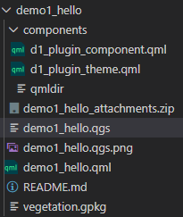

# Plugin Structure
Open ${ROOT}\qfield_vegetation_monitoring in Visual Studio Code or your prefered IDE and take a look at the Layout:



  - The main qml file is demo1_hello.qml. It must have same name as project and must be saved in the project directory with the project file
  - all other qml files are saved in the components subdirectory
  - this subdirectory must be added as an attachment directory in the project

## Globally imported Classes are defined in qmldir

The qmldir file is basically a global import directive.  

d1_plugin_theme.qml holds a style definition object that will hold colors and fonts that we will use consistently in our plugin.  Its like a css file.  

The qmldir file defines d1_plugin_theme.qml as a module that will be used globally and automatically imported.  It defines that the root element of this file will be imported and referred to in the code as the PluginTheme object.  

Note that d1_plugin_theme.qml has no reference to the class name PluginTheme.  This is only defined in the qmldir file.

### Definition of PluginTheme in qmldir

```qml
singleton PluginTheme 1.0 d1_plugin_theme.qml
```
### Contents of PluginTheme's File have no reference to PluginTheme

```qml
pragma Singleton
import QtQuick

QtObject {
    readonly property color vanilla: "#ffecd1"
    readonly property color green: "#6baa75"
    readonly property color white: "#ffffff"
}
```
# 📚 **[>> Let's examine the main Module](DEMO1_MAIN.md)**
## 📚 **[<< Plugin Deployment](DEMO1_DEPLOY.md)**
