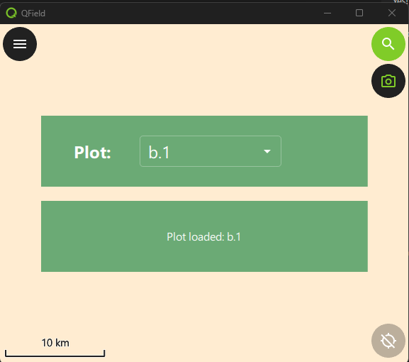
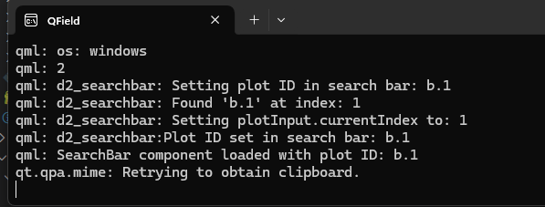

# Demonstration 2: Feature Selection with Search Bar and Map Selection

This demonstration builds on Demo 1 by adding a search bar that allows a user to select a feature from a layer. 

## What we will learn

- How to align Items using Layout Containers.
- How to access a project layer through the qfield interface
- How to query features from a layer through the qfield interface
- How to select objects from the map canvas using a point handler
- How to make a searchable Menu

## What does it do?
 
- It opens via a click on the camera icon to the right of the screen.  
- **OR** it opens when the user clicks on a plot.
- It displays a searchable drop down menu for plot ids.
- If you select a plot id from the menu by doubleClicking on the point, the selected plot id will be displayed in the text frame.
- A single click on the point will result in the usual Attribute Table behaviour
- If you type an invalid plot id in the menu, an error message will be displayed in the text frame.
- If you open using a map selection, the selected plot id will be displayed in the text frame.
- If you open using a map selection, the selected plot id will be selected in the drop down menu.
 

- It also prints messages to the dos console, instead of the user's message log when a map feature is selected. 

# Set it up

1. Create a new project directory: ${ROOT}/qfield_project_demo_2 
2. Copy the whole demo directory ${ROOT}/qfield_vegetation_plugin/demo2_searchbar ${ROOT}/qfield_project_demo_2
3. Open the project in QGIS.  The project has not changed from demo 1.
4. Upload the project to QFieldCloud using the QField Sync Plugin.
5. Load the project in the Windows QField

## 📚 **[Setting up Selection from the Map](DEMO2_MAP_CLICK.md)**
## 📚 **[<< Demonstration 1](../demo1/DEMO1_INTRO.md)**

