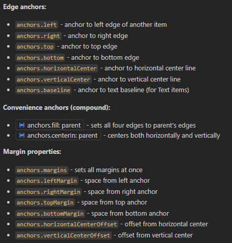

# Demo 2 Searchbar 

# demo2_searchbar.qml

This main piece of code is the same as demo1_hello.qml. We can skip over it.

# d2_plugin_component.qml

The plugin component has added a Loader for the search bar, and a ColumnLayout to make it pretty.

# QML: Aligning Items with Layouts

Qt decided to implement 2 different classes for QML Layouts.  This is not particularly helpful.

## Basic Positioner classes

- Row
- Column
- Grid
- Flow (actually useful, for text wrapping)

But of course the minute you try to do something a little bit sophisticated with your sizing, you want to use the more advanced:

## Layout classes

- RowLayout
- ColumnLayout
- Grid Layout

So its best to just start out using the Layout classes.

### Alignment Properties for Items in Layout classes

If you are using a Layout class, you can apply alignment properties to its children.  These properties are imported from QtQuick

- **Qt.AlignLeft** (default for items)
- **Qt.AlignHCenter** (horizontal center)
- **Qt.AlignRight**
- **Qt.AlignTop**
- **Qt.AlignVCenter** (vertical center)
- **Qt.AlignBottom**

Can combine: Qt.AlignHCenter | Qt.AlignVCenter

## Use of Layout classes in the plugin

- d2_plugin_component.qml uses a ColumnLayout to aligns the search bar and the message bar vertically.
   - The Items are centered horizontally in the column using **Layout.alignment: QAlignHCenter**
   - The Items get a 10% margin left and right with **width: pluginFrame * 0.8**

- d2_searchbar.qml uses a RowLayout to align the Label and ComboBox items horizontally.  We will look at that in a bit.

# QML: Aligning Items with anchors.

Using the ColumnLayout and the Layout class properties, we have aligned the 2 items in a column and centered them horizontally.
However, with just these changes, we would end up justifying the items from top to bottom. We haven't centered them vertically yet.

**Layout.alignment: QAlignHCenter | QAlignVCenter** would only succeed in rendering the 2 Items on top of each other.

We can solve the problem by defining the ColumnLayout to be centered in its parent using anchors.centerIn.  
So the column height is sized to the combined height of its children, centered with respect to its parent.

Another place we use anchors.centerIn: parent is for centering Text in our messageBox, with respect to its text Rectangle.  



## Just to keep you on your toes

If you use anchors.fill, QML will calculate the width of your Item according to the width of the parent element.
If you use anchors.centerIn, QML will calculate the width of your Item according to the width of its children.
The width of the children is set here to the width of the parent.  
Either the ColumnLayout needs to specifically define its width according to a definite object, or the child Items have to do it.  
The simplest solution is to set the width of the column explicitly according to its parent.

Note:  When we use anchors.centerIn instead of anchors.fill, the size of the column becomes 

# Connecting Signals 

Changes to the search bar trigger changes to the text in the MessageBox.  Either the id of the selected element is displayed, or an error message if an invalid plot id is entered.

The code here is written in standard Javascript.  The connections look more familiarly like pyqt connections.  item refers to the root Item loaded by the Loader Component.  It is a magic key word.  These signals: plotNotFound and plotLoaded, are custom signals defined in the root item of d2_searchbar.  We will look at this later.

You may notice that we do not use Component.onCompleted here, but Loader.onLoaded.  That is needlessly confusing.  Why?  Component.onCompleted fires after the Loader is constructed, but before its Component has loaded.  item is still null.  Loader's onLoaded signal doesn't fire until the source Component has loaded, so it guarantees that item exists, and we can safely access its signals. 

# d2_searchbar.qml
```qml
<...imports ...>
Rectangle {
  id: searchBar
  property var plotsLayer: null  // Initialize as null, set in Component.onCompleted
  
  // plot list
  ListModel {
    id: plot_model
  }

  // Signals to communicate with parent component
  signal plotNotFound(string plotId)
  signal plotLoaded(string plotId)
  signal layerLoadError(string message)
  
  // style
  width: parent.width
  height: 100
  color: PluginTheme.green


  RowLayout {
    anchors.centerIn: parent
    width: parent.width * 0.8
    spacing: 10

    Label {
      id: title
      horizontalAlignment: Text.AlignHCenter
      verticalAlignment: Text.AlignBottom
      text: "Plot: "
      color: PluginTheme.white
      font.pixelSize: 24
      font.bold: true
    }
    ComboBox {
      id: plotInput
      font.pixelSize: 24
      model: plot_model
      textRole: "label"
      valueRole: "label"
      editable: true
      Layout.preferredWidth: 200
      
      onActivated: {
        search_plot()
      }
      onAccepted: {
        search_plot()
      }
      function search_plot(){
        var plot_id = this.currentText;
        if (!plot_id || plot_id.trim() === "") {
          plotNotFound("Empty plot ID");
          return;
        }
        
        if (!plotsLayer) {
          plotNotFound("Layer not available");
          return;
        }
        
        try {
          var expression = "plot_id = '" + plot_id + "'";
          var feature_iterator = LayerUtils.createFeatureIteratorFromExpression(plotsLayer, expression);

          if (!feature_iterator.hasNext()){
            // error - emit signal to parent
            plotNotFound(plot_id);
            feature_iterator.close();
            return;
          } else{
            // success - emit signal to parent
            plotLoaded(plot_id);
          }
          feature_iterator.close();
        } catch (error) {
          console.log("Error searching for plot:", error);
          plotNotFound(plot_id + " (Error: " + error + ")");
        }
      }
    } 
  }

  Component.onCompleted: {
    // Initialize layer and populate model after component is fully loaded
    plotsLayer = qgisProject.mapLayersByName("plots")[0]
    populatePlotModel()
  }

  function populatePlotModel() {
    if (!plotsLayer) {
      console.log("Warning: plots layer not found")
      layerLoadError("Plots layer not found in project")
      return
    }
    
    try {
      plot_model.clear()
      
      // Get all features from the plots layer : there is no function to get all features, so we use an expression
      // so you have to use a catchall expression
      var feature_iterator = LayerUtils.createFeatureIteratorFromExpression(plotsLayer, "plot_id IS NOT NULL");
      var count = 0
      
      while (feature_iterator.hasNext()) {
        var feature = feature_iterator.next()
        var plot_id = feature.attribute("plot_id")
        if (plot_id) {
          plot_model.append({"label": plot_id})
          count++
        }
      }
      feature_iterator.close()
      
      if (count === 0) {
        layerLoadError("No plots found with plot_id attribute")
      }
    } catch (error) {
      console.log("Error populating plot model:", error)
      layerLoadError("Error loading plot data: " + error)
    }
  }
} // /searchBar Rectangle

```
## Lets go faster

At this point the ui gets a bit more complicated, and I am going to skip over some things that you can look up later.

- How to access a project layer through the qfield interface
- How to query features from a layer through the qfield interface
- How to make a searchable Menu